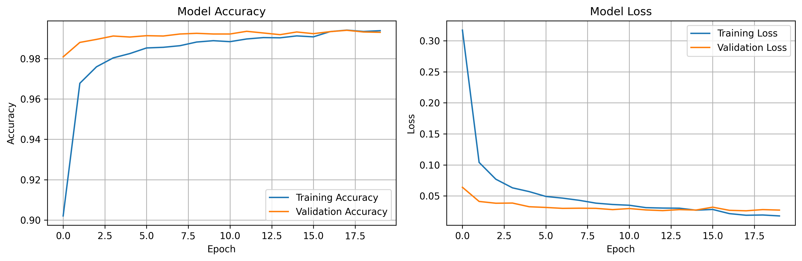
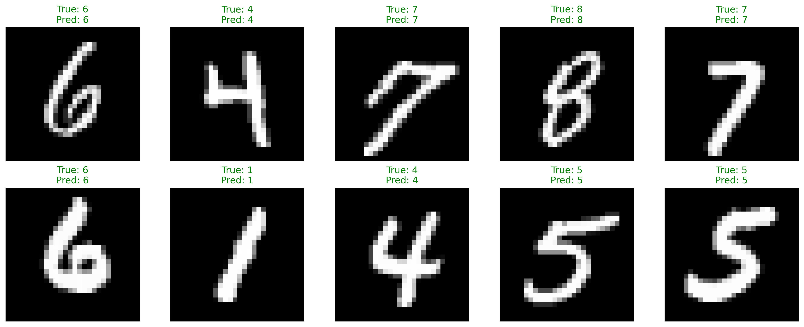

# 🔢 MNIST Handwritten Digit Recognizer

A deep learning project that trains a **Convolutional Neural Network (CNN)** to recognize handwritten digits (0-9) using the MNIST dataset. Perfect for learning about image processing, CNNs, and TensorFlow!

## 📋 Table of Contents
- [Features](#features)
- [Project Structure](#project-structure)
- [Requirements](#requirements)
- [Installation](#installation)
- [Usage](#usage)
- [Model Architecture](#model-architecture)
- [Results](#results)
- [How It Works](#how-it-works)
- [Contributing](#contributing)

## ✨ Features

- **Convolutional Neural Network** with dropout for regularization
- **99%+ accuracy** on MNIST test dataset
- **Easy-to-use prediction interface** for custom images
- **Automatic visualization** of training progress and predictions
- **Model checkpointing** and early stopping
- **Interactive prediction mode** for testing
- **Clean, documented code** suitable for learning

## 📁 Project Structure

```
mnist-digit-recognizer/
│
├── train_model.py          # Main training script
├── predict.py              # Prediction script for inference
├── requirements.txt        # Python dependencies
├── README.md              # This file
│
├── models/                # Saved trained models (created after training)
│   └── mnist_cnn_model.h5
│
└── results/               # Training visualizations and summaries
    ├── training_history.png
    ├── predictions.png
    └── training_summary.txt
```

## 🔧 Requirements

- Python 3.8 or higher
- TensorFlow 2.13+
- NumPy
- Matplotlib
- Pillow (PIL)

## 🚀 Installation

1. **Clone the repository**
```bash
git clone https://github.com/yourusername/mnist-digit-recognizer.git
cd mnist-digit-recognizer
```

2. **Create a virtual environment** (recommended)
```bash
python -m venv venv

# On Windows
venv\Scripts\activate

# On macOS/Linux
source venv/bin/activate
```

3. **Install dependencies**
```bash
pip install -r requirements.txt
```

## 💻 Usage

### Training the Model

Train the CNN model on the MNIST dataset:

```bash
python train_model.py
```

This will:
- Download the MNIST dataset automatically (if not already cached)
- Train the CNN for up to 20 epochs (with early stopping)
- Save the trained model to `models/`
- Generate visualizations in `results/`
- Display training progress and final accuracy

**Expected training time:** 5-10 minutes on CPU, ~1-2 minutes on GPU

### Making Predictions

#### Option 1: Interactive Mode
```bash
python predict.py
```

Then choose:
1. Predict from your own image file
2. Test on random MNIST samples
3. Exit

#### Option 2: Command Line Mode
```bash
python predict.py path/to/your/digit_image.png
```

#### Tips for Custom Images:
- Image should contain a single digit
- White digit on black background works best (like MNIST)
- The script will auto-resize and preprocess your image

## 🧠 Model Architecture

The CNN consists of:

```
Layer (type)                 Output Shape              Params
=================================================================
Conv2D                       (None, 26, 26, 32)        320
MaxPooling2D                 (None, 13, 13, 32)        0
Conv2D                       (None, 11, 11, 64)        18,496
MaxPooling2D                 (None, 5, 5, 64)          0
Flatten                      (None, 1600)              0
Dropout (0.5)                (None, 1600)              0
Dense                        (None, 128)               204,928
Dropout (0.3)                (None, 128)               0
Dense (softmax)              (None, 10)                1,290
=================================================================
Total params: 225,034
```

**Key Features:**
- Two convolutional blocks with ReLU activation
- Max pooling for dimensionality reduction
- Dropout layers to prevent overfitting
- Adam optimizer with adaptive learning rate
- Sparse categorical crossentropy loss

## 📊 Results

After training, you'll achieve:
- **Test Accuracy:** ~99%+
- **Training time:** 5-10 minutes (CPU)
- **Model size:** ~900 KB

### Example Outputs

**Training History:**


**Predictions:**


## 🔍 How It Works

### 1. **Data Preprocessing**
- MNIST images are 28×28 grayscale pixels
- Pixel values normalized from [0, 255] to [0, 1]
- Images reshaped to add channel dimension: (28, 28, 1)

### 2. **CNN Training**
- **Convolutional layers** extract features (edges, shapes)
- **Pooling layers** reduce spatial dimensions
- **Dense layers** perform final classification
- **Dropout** prevents overfitting by randomly dropping neurons

### 3. **Prediction**
- Input image is preprocessed (resized, normalized)
- CNN outputs probability distribution over 10 digits
- Highest probability determines the prediction

## 🎓 Learning Resources

This project demonstrates:
- **Image Classification** with deep learning
- **CNN Architecture** design and implementation
- **TensorFlow/Keras** API usage
- **Model training** with callbacks (early stopping, learning rate reduction)
- **Data preprocessing** and normalization
- **Model evaluation** and visualization

## 🤝 Contributing

Contributions are welcome! Here are some ideas:
- Add data augmentation for improved robustness
- Implement different CNN architectures
- Add web interface with Flask/Streamlit
- Support for drawing digits in real-time
- Export model to TensorFlow Lite for mobile deployment

## 📝 License

This project is open source and available under the MIT License.

## 🙏 Acknowledgments

- **MNIST Dataset:** Yann LeCun, Corinna Cortes, and Christopher J.C. Burges
- **TensorFlow:** Google Brain Team

---

**Happy Learning! 🚀**

If you found this project helpful, please give it a ⭐!
